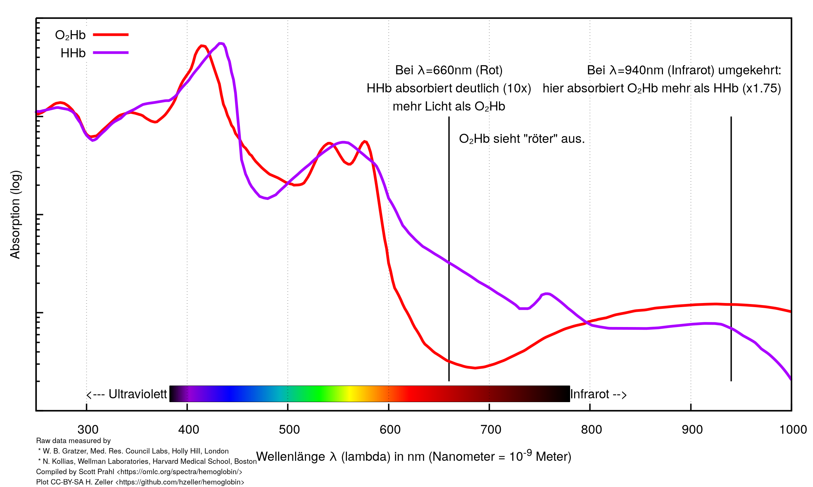
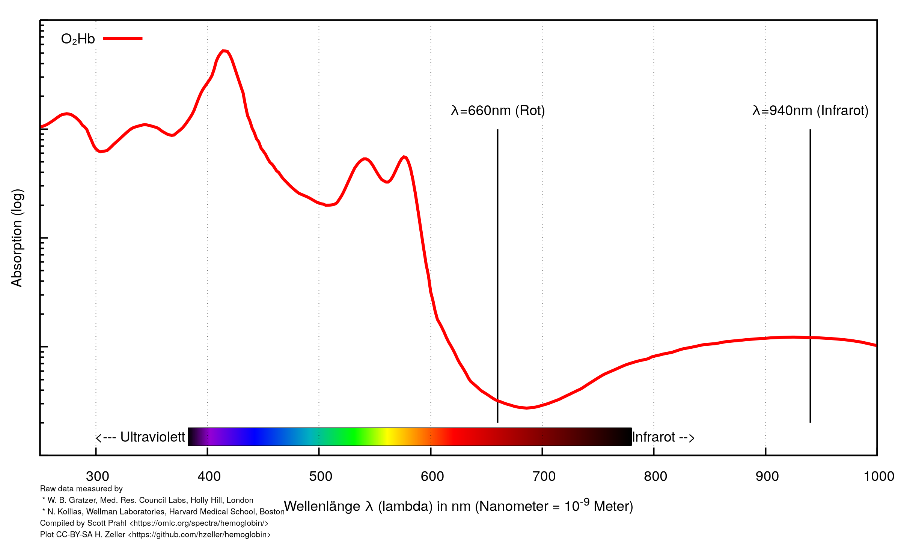
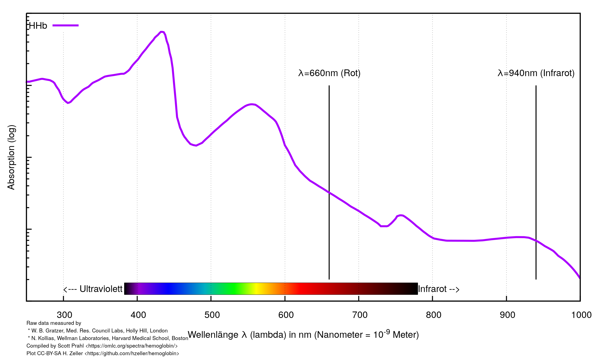

# Pulsoximeter
(sorry, in German, was used in a German-speaking country)

## Funktionsweise

Wenn man mit einer Wellenlaenge misst, kann man noch nicht auf die Konzentration
schliessen, weil ja das Lumen unterschiedlich ist von Person zu Person (z.B.
Kinderfinger und Erwachsener mit Wurstfingern ... beim letzteren kommt weniger
Licht durch). Oder allein schon vom Puls, weil ja der Finger 'pumpt'.

Wenn man also nur bei einer Wellenlaenge schaut, dann sieht man mehr oder
weniger Licht, aber weil man kein Vergleichswert hat, kann man daraus noch
nicht auf die Konzentration schliessen.

Schaut man sich an, was zwei Sensoren bei 660nm und 940nm messen, dann sieht
man, dass bei O₂-gesattigtem Blut 3.8x mehr licht im Infraroten absorbiert wird
wie bei 660nm Rot.
Und bei ungesaettigtem Blut nur 0.21x soviel (oder
4.6x 'weniger'). Und das ist ja unabhaengig vom Finger: wenn einer mit doppelt
so dickem Finger gemessen wird, dann misst man in beiden Wellelängen nur
die Hälfte; aber da ja die Messung bei beiden Wellenlängen auf die Hälfte
reduziert sind, ist ja das erwartete Verhältnis von 3.8x immer noch gleich.

Also dadurch dass man bei beiden Wellenlaengen misst, rechnet sich das raus.

Das gleiche, wenn sich das Lumen aendert ('pumpen' im Finger): mal ist mehr,
mal weniger Blut in demselben Finger, aber bei voller Sättigung wird man immer
messen, dass im Infraroten 3.8x mehr absorbiert wird.

Also duch das Messen an zwei Wellenlaengen rechnen sich Schwankungen
automatisch raus.

## Animation

https://youtu.be/TrGO6Bi2npU

## Build

To re-create

Rebuild graphs: `make`

Create animation: `./create-animation.sh`  (builds `animation.mp4`)

`make anim-clean` to delete the intermediate annimation pictures.

## Sources

The raw data in [hem.data](./hem.data) is compiled by
Scott Prahl &lt; https://omlc.org/spectra/hemoglobin/ &gt;

This plot and animation is shared under the License
CC-BY-SA Henner Zeller &lt;h.zeller@acm.org&gt;,
so you're free to use and modify in any context as long as you provide
Attribution and share your modification under the same license.
&lt; https://creativecommons.org/licenses/by-sa/4.0 &gt;
